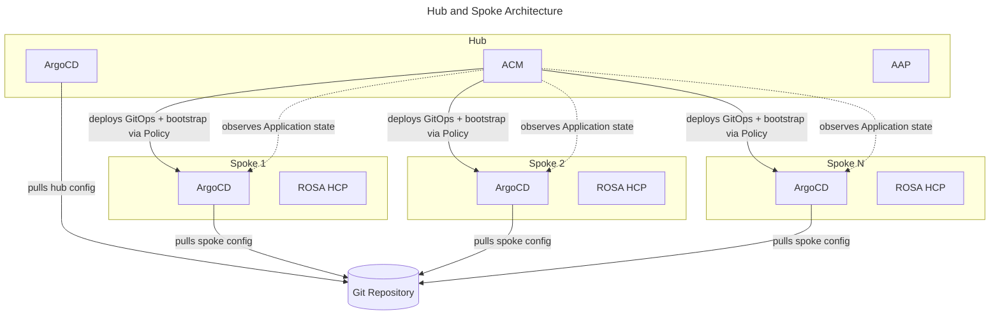

# hub-rosa-gitops

GitOps configuration for a hub ROSA HCP cluster using a hub-and-spoke architecture.

## Authors

- @ahussey-redhat
- @shaneboulden
- @joelapatatechaude
- @nreilly-rhn
- @snowjet

## Overview

ROSA-as-a-Service uses a hub and spoke architecture.
The hub cluster runs the shared services required to provision and manage spoke clusters.
Spoke clusters receive a baseline configuration via pull-based GitOps and are free to extend beyond that.

### Hub Cluster

The hub runs a minimal set of operators:

| Operator | Purpose |
|---|---|
| Red Hat Advanced Cluster Management (ACM) | Spoke cluster lifecycle, policy enforcement, observability |
| Ansible Automation Platform (AAP) | Automation and orchestration |
| AWS Controllers for Kubernetes (ACK) S3 | AWS resource management |
| OpenShift GitOps | Application delivery (ArgoCD) |

### Spoke Clusters (Pull-based GitOps)

Spoke clusters self-manage their configuration using a **pull-based** GitOps model:

1. ACM deploys OpenShift GitOps onto each spoke via policy (`policy-spoke-gitops-operator`)
2. ACM deploys a bootstrap ArgoCD `Application` on each spoke (`policy-spoke-gitops-bootstrap`)
3. The spoke's local ArgoCD pulls its configuration from this git repo (`2-environments/<env>/spoke/`)
4. ACM retains visibility into spoke ArgoCD Application state via the `managed-serviceaccount` addon

This means spokes do **not** require continuous API connectivity to the hub for GitOps changes — they pull independently of the `hub` cluster.


```mermaid
---
title: Hub and Spoke Architecture
---
flowchart TD
    git[(Git Repository)]

    subgraph Hub
        hub_argo[ArgoCD]
        acm[ACM]
        aap[AAP]
    end

    subgraph Spoke 1
        spoke1_argo[ArgoCD]
        spoke1[ROSA HCP]
    end

    subgraph Spoke 2
        spoke2_argo[ArgoCD]
        spoke2[ROSA HCP]
    end

    subgraph Spoke N
        spoken_argo[ArgoCD]
        spoken[ROSA HCP]
    end

    hub_argo -- pulls hub config --> git
    acm -- deploys GitOps + bootstrap via Policy --> spoke1_argo
    acm -- deploys GitOps + bootstrap via Policy --> spoke2_argo
    acm -- deploys GitOps + bootstrap via Policy --> spoken_argo
    spoke1_argo -- pulls spoke config --> git
    spoke2_argo -- pulls spoke config --> git
    spoken_argo -- pulls spoke config --> git
    acm -. observes Application state .-> spoke1_argo
    acm -. observes Application state .-> spoke2_argo
    acm -. observes Application state .-> spoken_argo
```

## Repository Structure

```
├── 1-bootstrap/              # Ansible playbook to bootstrap ArgoCD on the hub
├── 2-environments/           # Environment-specific configurations
│   ├── production/
│   │   ├── hub/              # Hub operator Applications
│   │   └── spoke/            # Spoke operator Applications (pulled by spoke ArgoCD)
│   └── development/
│       ├── hub/
│       └── spoke/
├── 3-operators/              # Operator definitions (base + overlays)
│   ├── aap/                  # Ansible Automation Platform
│   ├── ack-s3/               # AWS ACK S3 Controller
│   ├── acm/                  # Advanced Cluster Management
│   ├── certmanager/          # Cert Manager (available, not deployed by default)
│   ├── loki/                 # Loki Operator (available, not deployed by default)
│   ├── logging/              # Cluster Logging (available, not deployed by default)
│   ├── quay/                 # Quay Registry (available, not deployed by default)
│   └── rhacs/                # ACS (available, not deployed by default)
├── 4-policies/               # ACM policies
│   ├── spoke-gitops/         # Pull-based GitOps bootstrap for spokes
│   └── openshift-plus/       # OpenShift Plus compliance policies
```

## Setup

Please read the [bootstrap README](./1-bootstrap/README.md) to set up the environment.

## Extending

To add operators to an environment, create an ArgoCD `Application` in the relevant environment directory and reference it in the `kustomization.yaml`.

For example, to add RHACS to production spokes:

1. Create `2-environments/production/spoke/applications/rhacs-operator.yml` pointing to `3-operators/rhacs/aggregate/spoke/default`
2. Add it to `2-environments/production/spoke/kustomization.yaml`

The spoke's ArgoCD will pick up the change on its next sync.

## Contributing

Please read the [CONTRIBUTE](./CONTRIBUTE.md) document if you'd like to contribute to this project.
