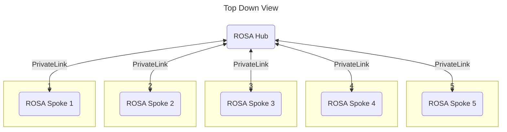

# hub-rosa-gitops

All the components required to configure a hub ROSA instance

## Authors

- @ahussey-redhat
- @shaneboulden
- @joelapatatechaude
- @nreilly-rhn 
- @snowjet

## Setup

Please read the [bootstrap README](./1-bootstrap/README.md) to setup the environment.

## Overview

ROSA-as-a-Service uses a hub and spoke architecture.
The central `hub` is has all of the shared services required to provision the `spoke`s.

The `hub` also monitors the `spoke`s health and compliance using Red Hat Advanced Cluster Manager for Kubernets and Red Hat Advanced Cluster Security for Kubernetes.

The `spoke`s have a baseline configuration applied, but gives the freedom and power to the end user for any further configuration.

## Contributing

Please read the [CONTRIBUTE](./CONTRIBUTE.md) document if you'd like to contribute to this project.

